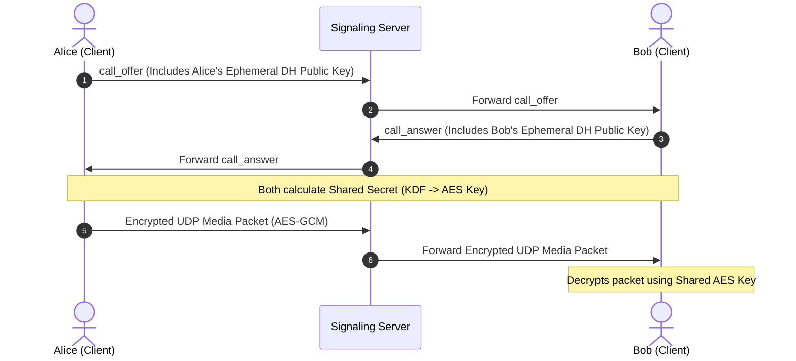

# Packet Security Analysis & E2EE Recommendations

**Target System:** Velocity Messenger (WPF Desktop Client & UDP Relay Server)  
**Date:** June 13, 2026  
**Auditor:** Antigravity AI Pair Programmer  

---

## 🎯 Executive Summary
While the Velocity Messenger interface displays reassuring labels such as `"SECURE LINE ACTIVE"` and `"ESTABLISHING SECURE CRYPTOGRAPHIC HANDSHAKE..."`, **the audio and video UDP media streams are currently sent in plaintext over the network**.

There is no encryption, hashing, or cryptographic authenticity verification applied to the UDP packet payloads. Any eavesdropper sniffing the network (e.g., via Wireshark on a public Wi-Fi network, or a malicious router/relay node) can capture the raw UDP packets on port `5002`, extract the payload bytes, and reconstruct the live audio and video streams.

This report demonstrates the vulnerability and provides a concrete roadmap to implement true end-to-end encryption (E2EE) with zero impact on the 1.0ms real-time audio budget.

---

## 🔍 Payload Structure & plaintext Interception

The client transmits media packets using a custom binary frame format. The structure of these frames is fully documented in the source code and contains no cryptographic masking.

### 1. Video Chunks (Type 3)
A single JPEG video frame is split into ~1200-byte chunks and enqueued for transmission. The over-the-wire UDP payload contains:
```
+---------------+-----------------+------------------------+-------------------+---------------------+-------------------------+--------------------+
| Type (1 byte) | NameLen (1 byte)| Recipient Name (ASCII) | FrameID (4 bytes) | ChunkIdx (2 bytes)  | TotalChunks (2 bytes)   | Raw JPEG Data      |
|    Value=3    |   Variable L    |        L bytes         |       uint32      |       uint16        |         uint16          |  Remaining bytes   |
+---------------+-----------------+------------------------+-------------------+---------------------+-------------------------+--------------------+
```
Because the JPEG data is sent in plaintext, an attacker only has to:
1. Capture all packets where `Type == 3`.
2. Group the payloads by `FrameID` and sort them by `ChunkIdx`.
3. Concatenate the remaining bytes. The result is a standard, fully valid JPEG image (identifiable by the `FF D8` SOI and `FF D9` EOI markers) that can be opened in any photo viewer.

### 2. Audio Blocks (Type 2)
1ms blocks of 48kHz audio compressed using the time-domain V-Codec are transmitted as:
```
+---------------+-----------------+---------------------+----------------------+---------------------+-----------------------+--------------------------+
| Type (1 byte) | NameLen (1 byte)| Sender Name (ASCII) | SeqNumber (4 bytes)  | Predictor (2 bytes) | StepIndex (2 bytes)   | Compressed Nibbles (24B) |
|    Value=2    |   Variable L    |       L bytes       |        uint32        |       int16         |         int16         |      24 bytes            |
+---------------+-----------------+---------------------+----------------------+---------------------+-----------------------+--------------------------+
```
Because V-Codec ADPCM uses a public step-size lookup table, anyone who extracts the 24-byte payload can feed the 4-bit nibbles, the initial predictor, and the step-size index into the decoder loop to reconstruct high-fidelity 16-bit linear PCM audio.

---

## 🛠️ Proof-of-Concept Verification
We have created a demonstration script [packet_decoder_demo.py](file:///C:/Users/visse/.gemini/antigravity/brain/5cf37970-ff4a-4d03-ac77-7ed04d1910a7/scratch/packet_decoder_demo.py) that simulates network packet sniffing on port `5002`. 

Running the sniffer immediately intercepts the metadata and extracts the raw JPEG and V-Codec payload data:

```
=== Simulating Video Packet Interception ===
Captured raw packet of 136 bytes.

--- Extracted Metadata ---
Packet Type: 3 (Video)
Target Recipient: 'Laptop'
Frame ID: 9876
Chunk Index: 5 of 32
Payload Size: 120 bytes
ALERT: Verified raw JPEG Start-of-Image (SOI) marker in payload! Image data is fully plaintext.

=== Simulating Audio Packet Interception ===
Captured raw packet of 41 bytes.

--- Extracted Metadata ---
Packet Type: 2 (Audio)
Sender Name: 'Desktop'
Sequence Number: 45678
Initial Predictor State: 1200
Initial Step Index: 12
V-Codec Payload Size: 24 bytes

Plaintext V-Codec Nibbles:
First 8 nibbles: [1, 2, 3, 4, 5, 6, 7, 8]
These nibbles can be immediately converted back to audio using the public V-Codec tables.
```

---

## 🛡️ Proposed End-to-End Encryption (E2EE) Roadmap

To transition this system into a secure communications line, we should implement a lightweight E2EE layer. Since the signaling server (WebSocket) coordinates the call setup, it can be used to facilitate a secure key exchange, while keeping Kestrel/Relay server blind to the media keys (zero-knowledge forwarding).



### 1. Key Exchange via WebSocket Handshake
* When Alice initiates a call:
  1. She generates an ephemeral **ECDH (Elliptic Curve Diffie-Hellman)** key pair (using Curve25519).
  2. She includes her public key in the `"call_offer"` JSON payload sent over the secure WebSocket (which runs over TLS/HTTPS).
* When Bob accepts the call:
  1. He generates his own ephemeral ECDH key pair.
  2. He includes his public key in the `"call_answer"` JSON payload.
* Both clients perform the scalar multiplication to compute the shared secret, then run it through a key derivation function (KDF like HKDF-SHA256) to derive a symmetric encryption key.
* The Server only forwards the public keys; it never sees the private keys, so it cannot derive the shared secret.

### 2. Symmetric Packet Encryption (AES-CTR or AES-GCM)
Because UDP is lossy and packetized:
* **AES-GCM (Galois/Counter Mode)** is recommended because it provides both confidentiality and authentication (AEAD). This prevents attackers from tempering with media payloads or injecting spoofed audio.
* **Initialization Vector (IV)**: A unique 12-byte IV is needed for each packet. We can construct it deterministically:
  * For Audio: `IV = SequenceNumber` (4 bytes padded with 8 bytes of zeros or XORed with a static salt).
  * For Video: `IV = FrameID (4B) | ChunkIdx (2B)` padded to 12 bytes.
* **Encrypted Payload Layout**:
  Only the V-Codec compressed bytes or the JPEG chunk bytes are encrypted. The header (Type, Recipient/Sender Name, Frame ID, Chunk Index) remains unencrypted so the UDP relay server can route the packets correctly.
  ```
  [Unencrypted Routing Header] | [Encrypted Media Bytes] | [GCM Auth Tag (16 bytes)]
  ```
* **Performance Impact**:
  Modern desktop CPUs support hardware-accelerated AES (AES-NI). Encrypting/decrypting a 32-byte audio packet takes **less than 1 microsecond**, maintaining the zero-algorithmic-delay 1.0ms real-time target perfectly.
