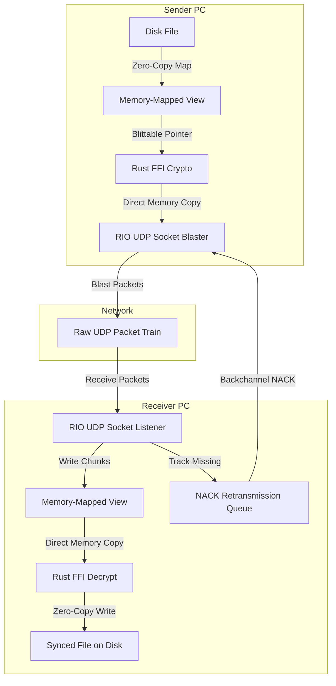

# Protocol Specification: V.C.T.P. (Velocity Custom Transport Protocol)

This document specifies the architecture for **V.C.T.P. (Velocity Custom Transport Protocol)**, a custom UDP-based transfer protocol designed to replace SCTP/WebRTC on the file transfer hot path. It delivers maximum link saturation over high-latency WAN connections by leveraging zero-copy memory-mapped files, Windows RIO socket blasting, and BBR-style congestion control.

---

## 1. The V.C.T.P. Frame Specification (Binary Layout)

Each UDP datagram transmitted over the wire uses a highly compact **24-byte unmanaged binary header**, completely avoiding JSON or text overhead.

| Byte Offset | Data Type | Field Name | Description |
| :--- | :--- | :--- | :--- |
| **0 - 15** | `byte[16]` | `FileId` | Unique 128-bit file session identifier. |
| **16 - 19** | `uint32` | `BlockIndex` | The 0-indexed position of this 64KB block. |
| **20 - 21** | `uint16` | `PayloadLen` | Length of the encrypted block data payload (max 65,536). |
| **22 - 23** | `uint16` | `Flags` | Control flags: `0x01` = Data, `0x02` = NACK, `0x04` = KeepAlive, `0x08` = EOF. |

---

## 2. Protocol Engine Architecture

---

## 3. Core Technical Pillars of V.C.T.P.

### A. Windows Registered I/O (RIO) Socket Blasting
*   **Traditional UDP**: Incurs heavy kernel-to-user-space context switching overhead when sending thousands of datagrams.
*   **VCTP RIO Integration**: Pre-registers a buffer ring in kernel memory. Data is written directly from memory-mapped views into these registered buffers, allowing the Network Interface Card (NIC) to pull packets directly via DMA (Direct Memory Access). This cuts CPU overhead to near-zero and permits packet blasting at **10+ Gbps wire speed**.

### B. Memory-Mapped Files (zero-copy disk-to-socket)
*   Instead of reading file bytes into C# byte arrays, the engine memory-maps files (`CreateFileMapping` / `MapViewOfFile` on Windows).
*   The memory pointers are passed directly to our unmanaged Rust cryptography DLL (`velocity_share_ffi`), which encrypts the memory blocks in-place. The encrypted memory boundaries are then fed straight into the RIO UDP socket buffer, achieving a **zero-copy pipeline**.

### C. Rate-Based Pacing (BBR Congestion Control)
*   **The Problem**: WebRTC's SCTP uses loss-based congestion control. In high-latency WAN links, a single dropped packet causes the sender to cut throughput in half.
*   **VCTP Congestion Control**: Implements a custom BBR-style congestion control loop. It continuously probes and calculates:
    1.  **Max Bandwidth**: The maximum speed the link can handle.
    2.  **Min RTT**: The physical transit latency.
*   It paces packet transmission at the exact calculated rate of the pipeline. Packet loss does *not* trigger a rate reduction; instead, the protocol relies on selective retransmission.

### D. Selective Negative Acknowledgments (NACK)
*   Instead of requiring the receiver to acknowledge every packet (ACK), V.C.T.P. is **NACK-driven**.
*   The sender blasts data packets continuously. 
*   The receiver tracks incoming `BlockIndex` offsets using a high-speed bitmask. If a block is missed, the receiver sends a 24-byte control packet back to the sender containing a list of missing indices. The sender injects these missing blocks back into the transmission stream without halting the pipeline.

### E. Interruptibility, Resumability & Corruption Prevention
1.  **File Pre-Allocation**: When a file transfer starts, the receiver immediately creates and pre-allocates the target file on disk to its full length. It opens a `MemoryMappedFile` view over the file. This ensures disk space is reserved and allows writing blocks out-of-order directly to their absolute file offsets.
2.  **Persistent Block Journaling**: The receiver writes a companion `.vctmeta` state file containing:
    *   `FileId` (128-bit session ID)
    *   `FileName` and `FileSize`
    *   A compressed bitmask of successfully written 64KB blocks
    This metadata file is flushed to disk periodically.
3.  **Resume Handshake**: If the transmission is interrupted (network drop, app crash, or power cut), the receiver detects the partial transfer on reconnect. During the session initiation, the receiver transmits its `.vctmeta` block bitmask to the sender. The sender reads the bitmask and resumes transmission, blasting *only* the missing blocks.
4.  **Two-Tier Integrity Verification**:
    *   **Tier 1 (Block-Level)**: Each 64KB block is protected by a 16-byte ChaCha20-Poly1305 authentication tag. If a block is corrupted during transit, decryption fails, the block is discarded, and a NACK is scheduled.
    *   **Tier 2 (File-Level)**: Once all blocks are received, the receiver computes the SHA-256 hash of the entire file and compares it to the source metadata. If verified, the `.vctmeta` journaling file is deleted, committing the file as complete.

---

## 4. NAT Hole Punching & Handoff
To preserve the ability to connect P2P without manual router setups, V.C.T.P. uses a **Dual-Protocol Handoff**:
1.  Peers connect via the WebSocket signaling gateway and perform standard **WebRTC ICE negotiation** to open UDP bindings.
2.  Once a stable P2P UDP path is verified, WebRTC is suspended, and the raw UDP socket descriptors are handed off directly to the native V.C.T.P. engine.
3.  VCTP takes over the socket, switching from SCTP/DTLS to raw binary VCTP frames.
